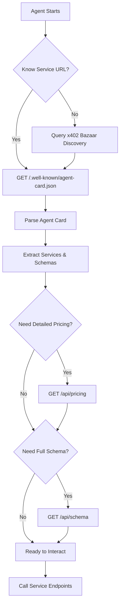

# Agent Discovery Guide - x402 Insurance

This document describes how autonomous agents can discover and interact with the x402 Insurance service.

## 🚀 Quick Start for Agents

**Key Features for Agents:**
1. **Memory Solution**: Use `GET /policies?wallet=0xYourAddress` to recover policy_id after context resets
2. **Idempotency**: Add `Idempotency-Key` header to `/claim` requests to safely retry
3. **Claim Status**: Poll `GET /claims/{claim_id}` to check claim progress
4. **Rate Limits**: See agent card metadata for limits (10/hour for /insure, 5/hour for /claim)
5. **Timeout Guidance**: Use 30-45s timeout for `/claim` (includes 10-20s zkp generation)

**Critical Endpoints:**
- `/.well-known/agent-card.json` - Complete service discovery (includes rate limits, timeouts, error handling)
- `/policies?wallet=0x...` - **Retrieve your policies by wallet address** (solves memory problem!)
- `/claims/{claim_id}` - Check claim status
- `/insure` - Purchase policy (x402 payment required)
- `/claim` - File fraud claim (with idempotency support)

## Discovery Endpoints

### 1. **Agent Card** (A2A Protocol)
```
GET /.well-known/agent-card.json
```

**Standard A2A Discovery Endpoint**
Returns complete service metadata including identity, capabilities, services, and pricing.

**Response Structure:**
```json
{
  "x402Version": 1,
  "agentCardVersion": "1.0",
  "identity": {
    "name": "x402 Insurance",
    "description": "Zero-knowledge proof verified insurance...",
    "provider": "x402 Insurance",
    "version": "1.0.0",
    "url": "https://your-domain.com"
  },
  "capabilities": {
    "x402": true,
    "zkProofs": true,
    "instantRefunds": true,
    "micropayments": true,
    "networks": ["base"],
    "protocols": ["x402", "a2a"]
  },
  "services": [
    {
      "id": "insurance-policy",
      "name": "Create Insurance Policy",
      "endpoint": "https://your-domain.com/insure",
      "method": "POST",
      "x402Required": true,
      "payment": {
        "scheme": "exact",
        "network": "base",
        "maxAmountRequired": "1000",
        "asset": "0x833589fCD6eDb6E08f4c7C32D4f71b54bdA02913",
        "payTo": "0xba72eD...",
        "description": "Insurance premium",
        "maxTimeoutSeconds": 60
      },
      "inputSchema": { ... },
      "outputSchema": { ... }
    },
    ...
  ]
}
```

**Use Cases:**
- Automatic service discovery by autonomous agents
- Understanding service capabilities and requirements
- Schema-based request/response validation
- x402 payment parameter extraction

---

### 2. **Pricing Information**
```
GET /api/pricing
```

**Detailed pricing and economics**

**Response:**
```json
{
  "premium": {
    "amount": 0.001,
    "units": 1000,
    "currency": "USDC",
    "display": "$0.001 (1/10th of a cent)",
    "network": "base"
  },
  "coverage": {
    "min": 0.01,
    "max": 1.0,
    "currency": "USDC",
    "recommended": 0.01
  },
  "policy_duration": {
    "hours": 24,
    "seconds": 86400
  },
  "payment": {
    "protocol": "x402",
    "network": "base",
    "token": {
      "symbol": "USDC",
      "address": "0x833589fCD6eDb6E08f4c7C32D4f71b54bdA02913",
      "decimals": 6
    },
    "payTo": "0xba72eD..."
  },
  "economics": {
    "protection_ratio": "Up to 1000x",
    "example": {
      "premium_paid": "$0.001",
      "api_call_cost": "$0.01",
      "coverage": "$0.01",
      "net_cost_if_fraud": "$0.001 (just the premium)"
    }
  }
}
```

**Use Cases:**
- Cost-benefit analysis before purchasing insurance
- Understanding payment requirements
- Calculating optimal coverage amounts

---

### 3. **OpenAPI Schema**
```
GET /api/schema
```

**Complete API specification in OpenAPI 3.0 format**

**Accepts:**
- `application/json` → Returns JSON schema
- `application/yaml` → Returns YAML schema

**Response:**
```json
{
  "openapi": "3.0.3",
  "info": {
    "title": "x402 Insurance API",
    "version": "1.0.0",
    "description": "..."
  },
  "paths": {
    "/insure": { ... },
    "/claim": { ... },
    "/verify": { ... },
    ...
  },
  "components": {
    "schemas": { ... }
  }
}
```

**Use Cases:**
- Generate client SDKs automatically
- Validate requests/responses
- Type-safe API interactions
- Documentation generation

---

### 4. **API Information**
```
GET /api
```

**Quick service overview with x402 metadata**

**Response:**
```json
{
  "service": "x402 Insurance API",
  "version": "1.0.0",
  "x402Version": 1,
  "description": "...",
  "category": "insurance",
  "endpoints": {
    "discovery": "GET /.well-known/agent-card.json",
    "schema": "GET /api/schema",
    "pricing": "GET /api/pricing",
    "create_policy": "POST /insure (x402 payment required)",
    "submit_claim": "POST /claim",
    "verify_proof": "POST /verify (public)"
  },
  "x402": {
    "paymentRequired": {
      "/insure": {
        "scheme": "exact",
        "network": "base",
        "maxAmountRequired": "1000",
        "asset": "0x833589fCD6eDb6E08f4c7C32D4f71b54bdA02913",
        "payTo": "0xba72eD...",
        "description": "Insurance premium for micropayment protection",
        "mimeType": "application/json",
        "maxTimeoutSeconds": 60
      }
    }
  },
  "links": {
    "documentation": "https://your-domain.com/api/schema",
    "pricing": "https://your-domain.com/api/pricing",
    "agentCard": "https://your-domain.com/.well-known/agent-card.json"
  }
}
```

**Use Cases:**
- Quick service capability check
- x402 payment parameters for protected endpoints
- Navigation to other discovery resources

---

### 5. **Health Check**
```
GET /health
```

**Service health status**

**Response:**
```json
{
  "status": "healthy",
  "zkengine": "operational",
  "blockchain": "connected"
}
```

---

## Agent Discovery Flow

### Recommended Discovery Sequence



### Step-by-Step Discovery

**Step 1: Fetch Agent Card**
```bash
curl https://your-domain.com/.well-known/agent-card.json
```

Extract:
- Service capabilities
- Available services
- Payment requirements
- Input/output schemas

**Step 2: Extract Insurance Service**
```javascript
const agentCard = await fetch('/.well-known/agent-card.json').then(r => r.json());
const insuranceService = agentCard.services.find(s => s.id === 'insurance-policy');

// Extract payment details
const payment = insuranceService.payment;
// scheme: "exact"
// network: "base"
// maxAmountRequired: "1000"  // 0.001 USDC in smallest units
// asset: "0x833589fCD6eDb6E08f4c7C32D4f71b54bdA02913"
// payTo: "0xba72eD..."

// Extract schemas for validation
const inputSchema = insuranceService.inputSchema;
const outputSchema = insuranceService.outputSchema;
```

**Step 3: Purchase Insurance (x402 Payment)**
```javascript
// Make request to protected endpoint
const response = await fetch('https://your-domain.com/insure', {
  method: 'POST',
  headers: {
    'Content-Type': 'application/json',
    'X-Payment': '...'  // x402 payment proof
  },
  body: JSON.stringify({
    merchant_url: 'https://api.example.com/data',
    coverage_amount: 0.01
  })
});

// If 402, sign payment and retry
if (response.status === 402) {
  const paymentDetails = await response.json();
  const signedPayment = await signX402Payment(paymentDetails);

  // Retry with payment
  const retryResponse = await fetch('https://your-domain.com/insure', {
    method: 'POST',
    headers: {
      'Content-Type': 'application/json',
      'X-Payment': signedPayment
    },
    body: JSON.stringify({
      merchant_url: 'https://api.example.com/data',
      coverage_amount: 0.01
    })
  });
}
```

---

## x402 Bazaar Registration

To make your service discoverable via x402 Bazaar:

### Method 1: Automatic Registration (Recommended)

1. **Use CDP Facilitator** - Ensure you're using the latest CDP facilitator for x402 payments
2. **Set discoverable: true** - In your service configuration
3. **Provide Rich Metadata** - Complete schemas, descriptions, pricing

**Requirements:**
```javascript
{
  description: "Clear, detailed service description",
  inputSchema: {
    type: "object",
    required: ["merchant_url", "coverage_amount"],
    properties: {
      merchant_url: {
        type: "string",
        format: "uri",
        description: "Merchant API endpoint to protect"
      },
      coverage_amount: {
        type: "number",
        minimum: 0.001,
        maximum: 0.1,
        description: "Coverage amount in USDC"
      }
    }
  },
  outputSchema: { ... },
  price: "1% of coverage",
  network: "base",
  payTo: "0x..."
}
```

Services are automatically ingested into:
```
https://api.cdp.coinbase.com/platform/v2/x402/discovery/resources
```

### Method 2: Manual CDP API Registration

For external facilitators (Q4 2025 roadmap):
```bash
curl -X POST https://api.cdp.coinbase.com/platform/v2/x402/resources \
  -H "Authorization: Bearer YOUR_CDP_API_KEY" \
  -H "Content-Type: application/json" \
  -d '{
    "resource": "https://your-domain.com/insure",
    "type": "http",
    "x402Version": 1,
    "accepts": [...],
    "metadata": {
      "category": "insurance",
      "provider": "x402 Insurance"
    }
  }'
```

---

## Agent Integration Examples

### Python Agent
```python
import httpx
from x402.client import X402Client

# Discover service
async def discover_insurance():
    async with httpx.AsyncClient() as client:
        # Fetch agent card
        card = await client.get('https://your-domain.com/.well-known/agent-card.json')
        card_data = card.json()

        # Find insurance service
        insurance = next(
            s for s in card_data['services']
            if s['id'] == 'insurance-policy'
        )

        return insurance

# Purchase insurance with x402
async def buy_insurance(merchant_url: str, coverage: float):
    insurance_service = await discover_insurance()

    x402 = X402Client()

    # Make x402 payment and call service
    response = await x402.post(
        url=insurance_service['endpoint'],
        json={
            'merchant_url': merchant_url,
            'coverage_amount': coverage
        },
        payment=insurance_service['payment']
    )

    return response.json()
```

### TypeScript Agent
```typescript
import { useFacilitator } from "x402/verify";
import { facilitator } from "@coinbase/x402";

// Discover via Bazaar
async function discoverViaB azaar() {
  const { list } = useFacilitator(facilitator);
  const discovery = await list({ type: "http" });

  // Find insurance service
  const insurance = discovery.items.find(
    item => item.metadata?.category === "insurance"
  );

  return insurance;
}

// Purchase insurance
async function buyInsurance(merchantUrl: string, coverage: number) {
  const service = await discoverViaBazaar();

  // Call with x402 payment
  const response = await fetch(service.resource, {
    method: 'POST',
    headers: {
      'Content-Type': 'application/json',
      'X-Payment': await signX402Payment(service.accepts[0])
    },
    body: JSON.stringify({
      merchant_url: merchantUrl,
      coverage_amount: coverage
    })
  });

  return response.json();
}
```

---

## Best Practices for Agents

### 1. Cache Discovery Data
```python
from datetime import datetime, timedelta

class InsuranceDiscoveryCache:
    def __init__(self):
        self.cache = None
        self.cache_time = None
        self.ttl = timedelta(hours=1)

    async def get_agent_card(self):
        if self.cache and datetime.now() - self.cache_time < self.ttl:
            return self.cache

        # Fetch fresh data
        async with httpx.AsyncClient() as client:
            response = await client.get(
                'https://your-domain.com/.well-known/agent-card.json'
            )
            self.cache = response.json()
            self.cache_time = datetime.now()
            return self.cache
```

### 2. Validate Schemas
```python
import jsonschema

def validate_request(data, service):
    try:
        jsonschema.validate(
            instance=data,
            schema=service['inputSchema']
        )
        return True
    except jsonschema.ValidationError as e:
        print(f"Invalid request: {e.message}")
        return False

# Before calling service
request_data = {
    "merchant_url": "https://api.example.com",
    "coverage_amount": 0.01
}

if validate_request(request_data, insurance_service):
    response = await buy_insurance(**request_data)
```

### 3. Handle Payment Failures Gracefully
```python
async def buy_with_retry(merchant_url: str, coverage: float, max_retries=3):
    for attempt in range(max_retries):
        try:
            response = await buy_insurance(merchant_url, coverage)
            return response
        except X402PaymentError as e:
            if attempt < max_retries - 1:
                await asyncio.sleep(2 ** attempt)  # Exponential backoff
                continue
            raise
```

### 4. Monitor Service Health
```python
async def check_health():
    async with httpx.AsyncClient() as client:
        health = await client.get('https://your-domain.com/health')
        status = health.json()

        if status['status'] != 'healthy':
            print(f"⚠️  Service unhealthy: {status}")
            return False
        return True
```

---

## Error Handling & Recovery Strategies

### Common Errors and How to Handle Them

#### 1. **429 Rate Limit Exceeded**
```python
# Problem: Too many requests
response = requests.post('/insure', ...)
# Response: 429 Too Many Requests
# {
#   "error": "Rate limit exceeded",
#   "retry_strategy": {
#     "recommendation": "Implement exponential backoff",
#     "example_delays": [1, 2, 4, 8, 16]
#   }
# }

# Solution: Exponential backoff with retry
import time

def call_with_backoff(func, max_retries=5):
    for attempt in range(max_retries):
        try:
            return func()
        except RateLimitError as e:
            if attempt < max_retries - 1:
                delay = 2 ** attempt  # 1s, 2s, 4s, 8s, 16s
                time.sleep(delay)
                continue
            raise
```

**Rate Limits:**
- `/insure`: 10 per hour
- `/claim`: 5 per hour
- General: 200 per day, 50 per hour

**Best Practice:** Cache discovery endpoints (agent-card, pricing, schema) to conserve requests.

---

#### 2. **402 Payment Required**
```python
# Problem: First request without payment
response = requests.post('/insure', json=data)
# Response: 402 Payment Required
# {
#   "x402Version": 1,
#   "payment": {
#     "scheme": "exact",
#     "network": "base",
#     "amount": "100",
#     "asset": "0x833589fCD6eDb6E08f4c7C32D4f71b54bdA02913",
#     "pay_to": "0xba72eD...",
#     "maxTimeoutSeconds": 60
#   }
# }

# Solution: Sign payment and retry
from x402 import sign_payment

payment_header = sign_payment(
    amount=response.json()['payment']['amount'],
    asset=response.json()['payment']['asset'],
    pay_to=response.json()['payment']['pay_to'],
    wallet=agent_wallet
)

# Retry with payment header
response = requests.post('/insure',
    headers={'X-Payment': payment_header, 'X-Payer': agent_wallet.address},
    json=data
)
# Response: 201 Created (policy created!)
```

---

#### 3. **Policy Not Found / Forgotten policy_id**
```python
# Problem: Agent context reset, policy_id lost
# ❌ BAD: Try to remember policy_id in memory
policy_id = agent.memory.get('policy_id')  # Returns None after context reset!

# ✅ GOOD: Query by wallet address
policies_response = requests.get(f'/policies?wallet={agent.wallet.address}')
policies = policies_response.json()['active_policies']

# Find policy for failed merchant
failed_merchant = "https://api.example.com"
policy = next(p for p in policies if p['merchant_url'] == failed_merchant)
policy_id = policy['policy_id']

# Now file claim
claim_response = requests.post('/claim', json={
    'policy_id': policy_id,
    'http_response': {...}
})
```

**Why This Works:**
- Agents always know their wallet address (it's fundamental to identity)
- No need to persist policy_id across context resets
- `/policies` endpoint is stateless and always available

---

#### 4. **Claim Timeout / Proof Generation Failure**
```python
# Problem: zkp generation takes 10-20 seconds, request times out
import httpx

# ❌ BAD: Default timeout (5s)
response = httpx.post('/claim', json=claim_data)  # Times out!

# ✅ GOOD: Use appropriate timeout
response = httpx.post('/claim',
    json=claim_data,
    timeout=45.0  # 30-45 seconds recommended
)

# OR: Use idempotency for safe retry
import uuid
idempotency_key = str(uuid.uuid4())

try:
    response = httpx.post('/claim',
        headers={'Idempotency-Key': idempotency_key},
        json=claim_data,
        timeout=45.0
    )
except httpx.TimeoutException:
    # Safe to retry with same idempotency key
    response = httpx.post('/claim',
        headers={'Idempotency-Key': idempotency_key},
        json=claim_data,
        timeout=45.0
    )
    # Will return existing claim if first request succeeded
```

**Recommended Timeouts:**
- `/insure`: 5-10 seconds
- `/claim`: 30-45 seconds (includes zkp generation)
- `/verify`: 5-10 seconds

---

#### 5. **Duplicate Claim Prevention**
```python
# Problem: Network error during claim submission, agent retries
# ❌ RISKY: Retry without idempotency key
response1 = requests.post('/claim', json=claim_data)  # Network error
response2 = requests.post('/claim', json=claim_data)  # Creates duplicate claim!

# ✅ SAFE: Use idempotency key
import hashlib

# Generate deterministic idempotency key based on claim data
claim_hash = hashlib.sha256(
    f"{policy_id}:{http_status}:{http_body_hash}".encode()
).hexdigest()

response = requests.post('/claim',
    headers={'Idempotency-Key': claim_hash},
    json=claim_data
)
# If claim already exists, returns existing claim with status 200
# If new claim, processes and returns with status 201
```

---

#### 6. **Policy Expired**
```python
# Problem: Trying to file claim after 24-hour window
response = requests.post('/claim', json={'policy_id': old_policy_id, ...})
# Response: 400 Bad Request
# {"error": "Policy expired"}

# Solution: Monitor policy expiration proactively
from datetime import datetime, timedelta

def monitor_policies(agent_wallet):
    policies = requests.get(f'/policies?wallet={agent_wallet.address}').json()

    for policy in policies['active_policies']:
        expires_at = datetime.fromisoformat(policy['expires_at'].replace('Z', '+00:00'))
        time_remaining = expires_at - datetime.now()

        if time_remaining < timedelta(hours=1):
            print(f"⚠️  Policy {policy['policy_id']} expires in {time_remaining}!")
            # File claim ASAP if merchant has failed
```

**Policy Duration:** 24 hours from creation
**Grace Period:** None
**Recommendation:** File claims within 23 hours of policy creation

---

#### 7. **Checking Claim Status**
```python
# Problem: Want to know if claim is being processed
# After submitting claim:
claim_response = requests.post('/claim', json=claim_data)
claim_id = claim_response.json()['claim_id']

# Poll for status (useful for async workflows)
import time

def wait_for_claim(claim_id, timeout=60):
    start_time = time.time()
    while time.time() - start_time < timeout:
        status = requests.get(f'/claims/{claim_id}').json()

        if status['status'] == 'paid':
            print(f"✅ Claim paid! TX: {status['refund_tx_hash']}")
            return status
        elif status['status'] == 'failed':
            print(f"❌ Claim failed!")
            return status

        time.sleep(2)  # Poll every 2 seconds

    raise TimeoutError("Claim processing timed out")

# Use for monitoring
try:
    final_status = wait_for_claim(claim_id)
    print(f"Received {final_status['payout_amount']} USDC")
except TimeoutError:
    print("Claim taking longer than expected, check /claims/{claim_id} later")
```

---

### Error Response Reference

| Status Code | Error | Meaning | Recovery Strategy |
|-------------|-------|---------|-------------------|
| 400 | Bad Request | Invalid input data | Check inputSchema, validate request |
| 402 | Payment Required | x402 payment needed | Sign payment and retry with X-Payment header |
| 404 | Not Found | Policy/claim doesn't exist | Use /policies to find correct policy_id |
| 429 | Rate Limit | Too many requests | Exponential backoff (1s, 2s, 4s, 8s...) |
| 500 | Server Error | Internal service error | Retry with backoff, check /health endpoint |
| 503 | Service Unavailable | Service temporarily down | Check /health, wait and retry |

---

## Discovery Metadata Standards

### Required Fields for Optimal Discovery

**Service Identity:**
- `name`: Clear, descriptive name
- `description`: Detailed explanation (50-200 chars)
- `provider`: Provider/organization name
- `version`: Semantic version (e.g., "1.0.0")

**x402 Payment:**
- `scheme`: "exact" for fixed price
- `network`: "base" or "base-sepolia"
- `maxAmountRequired`: String integer in smallest units
- `asset`: USDC contract address
- `payTo`: Recipient wallet address
- `maxTimeoutSeconds`: Maximum processing time

**Schemas:**
- `inputSchema`: Complete JSON Schema with descriptions
- `outputSchema`: Expected response structure
- Both should include `type`, `required`, `properties`

**Performance Metrics:**
- `zkp_generation_time_ms`: "10000-20000"
- `refund_time_ms`: "2000-5000"
- `total_claim_time_ms`: "15000-30000"

---

## Support & Resources

- **Agent Card Spec**: https://github.com/coinbase/agentkit
- **x402 Specification**: https://github.com/coinbase/x402/blob/main/specs/x402-specification.md
- **x402 Bazaar**: https://docs.cdp.coinbase.com/x402/bazaar
- **OpenAPI 3.0**: https://spec.openapis.org/oas/v3.0.3

---

## Service URL

**Production**: `https://your-domain.com`
**Agent Card**: `https://your-domain.com/.well-known/agent-card.json`
**Pricing**: `https://your-domain.com/api/pricing`
**Schema**: `https://your-domain.com/api/schema`
